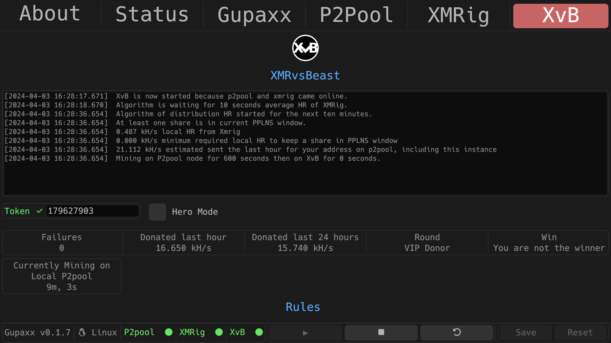
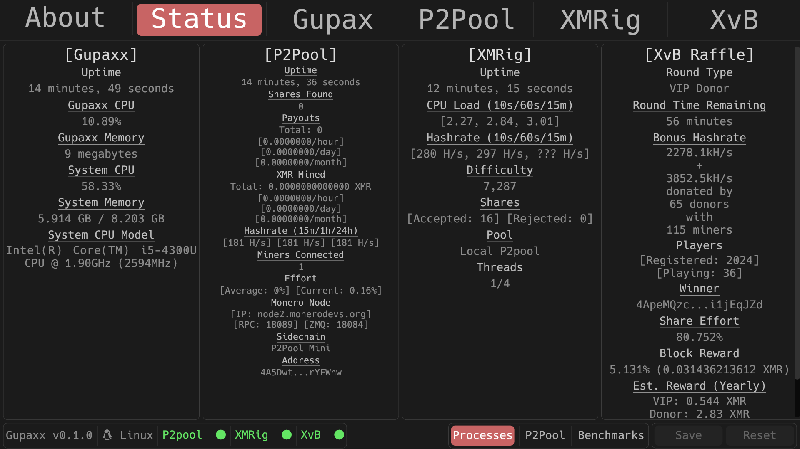

## Status of development

This fork is a work in progress, trying to achieve the bounty [**A fork of GUPAX integrating the XMRvsBeast Bonus Hashrate Raffle for P2Pool Miners**](https://bounties.monero.social/posts/105).

It is not yet ready for stable release. It works in theory but not yet tested enough. Please feel free to test the beta release and open an issue if you encounter an anomaly.

You can see the progress with [TODO](TODO_XMRvsBeast.md)

## Gupaxx

Gupaxx is a fork of [**Gupax**](https://github.com/hinto-janai/gupax) integrating the [XMRvsBeast Raffle](https://xmrvsbeast.com), it is also a maintained software. It is made to make in the most easy way possible mining on P2Pool while optionally participating (but you will want to :wink:) in the XMRvsBeast raffle.  

## Contents
* [What is Gupaxx/XMRvsBeast?](#what-is-gupaxxxmrvsbeast)  
* [Guide](#guide) 
* [XvB Tab](#xvb-tab) 
	- [Console](#console-of-xvb) 
	- [Token Input](#token-input) 
	- [Private stats](#private-stats) 
* [XvB Raffle](#xvb-raffle-status) 
* [Other changes](#other-changes) 
* [License](#license) 

## What is Gupaxx/XMRvsBeast?
[**`Gupaxx`**](https://getmonero.org) is a fork of [*Gupax*](https://github.com/hinto-janai/gupax) that integrate the [XMRvsBeast raffle](https://xmrvsbeast.com).

This fork adds an easy way to distribute your hashrate between P2pool and XMRvsBeast to participate in the raffle to win more xmr while supporting the p2pool network.

To have a detailed explication of Gupax, see the [README](https://github.com/hinto-janai/gupax) of upstream.

## Guide

1. [Download the bundled version of Gupaxx](https://github.com/Cyrix126/gupaxx/releases)
2. Extract
3. Launch Gupaxx

Next steps can be seen in this video tutorial.  

https://github.com/Cyrix126/gupaxx/assets/58007246/610cbfea-fd97-4150-95ed-9c8a7ef5ba94

4. Input your Monero address in the `P2Pool` tab
5. Register your same address on [XMRvsBeast](https://xmrvsbeast.com)
6. Input the token received in the XvB Tab
6. Start P2Pool
7. Start XMRig
8. Start XvB

Gupaxx will distribute your hashrate between P2Pool and XMRvsBeast as defined here by the [algorithm](NOTES_ALGORITHM).

The algorithm will decide which quantity of HR will be directed to P2pool and to XMRvsBeast, so that you still keep a share in the [PPLNS Window](https://github.com/SChernykh/p2pool#how-payouts-work-in-p2pool). It will send by default just enough to get to the highest round or, if hero mode is enabled, everything minus minimum required to still have a share in the PPLNS Window.

## XvB Tab

### Console of XvB

The output of console will show useful information on the status of the XvB process and the decision of the algorithm for every 10 minutes.

### Token input

You need to put the token received when you registered your XMR payout address.

### Private stats

Private information about your address on XMRvsBeast can be found here after the process is started with your token provided.

## XvB Raffle Status

Gupaxx add a new column **XvB Raffle** on the Status Tab in the Process submenu. It displays public statistics of XMRvsBeast, which are available here 
It is refreshed every minute.
This column will be active if the XvB process is started even partially, it doesn't need the token to be provided.

## Other changes

This fork brings upgrades of dependence and some bugfixes about visual, performance and security that you can find in [DIFFERENCES](DIFFERENCES.md).  
I will eventually (meaning when I'll have time) create pull requests for upstream about these differences.

## Troubleshooting

If you have any issue, feel free to ask for support in the [xmrvsbeast matrix room](#xmrvsbeast:monero.social) or to open an issue in this repo. You can also contact me though [email](email:gupaxx@baermail.fr).

### Windows

You must add an exception to your antivirus for the directory where gupaxx is executed. Follow the step for Windows Only that start at 30 seconds in this [video](https://user-images.githubusercontent.com/101352116/207978455-6ffdc0cc-204c-4594-9a2f-e10c505745bc.mp4).

### Mac OSX

You must remove Gupaxx app from quarantine with following command:  
*If you have put Gupaxx.app in your Applications*  
`xattr -d com.apple.quarantine /Applications/Gupaxx.app`
See this [issue](https://github.com/hinto-janai/gupax/issues/51).

## License
The GUI library Gupaxx uses is [egui](https://github.com/emilk/egui). It is licensed under [MIT](https://github.com/emilk/egui/blob/master/LICENSE-MIT) & [Apache 2.0.](https://github.com/emilk/egui/blob/master/LICENSE-APACHE)

[Many other libraries are used that have various licenses.](https://github.com/hinto-janai/gupax/blob/master/Cargo.toml)

[Gupaxx](https://github.com/cyrix126/gupax/blob/master/LICENSE), [P2Pool](https://github.com/SChernykh/p2pool/blob/master/LICENSE), and [XMRig](https://github.com/xmrig/xmrig/blob/master/LICENSE) are licensed under the GNU General Public License v3.0.
